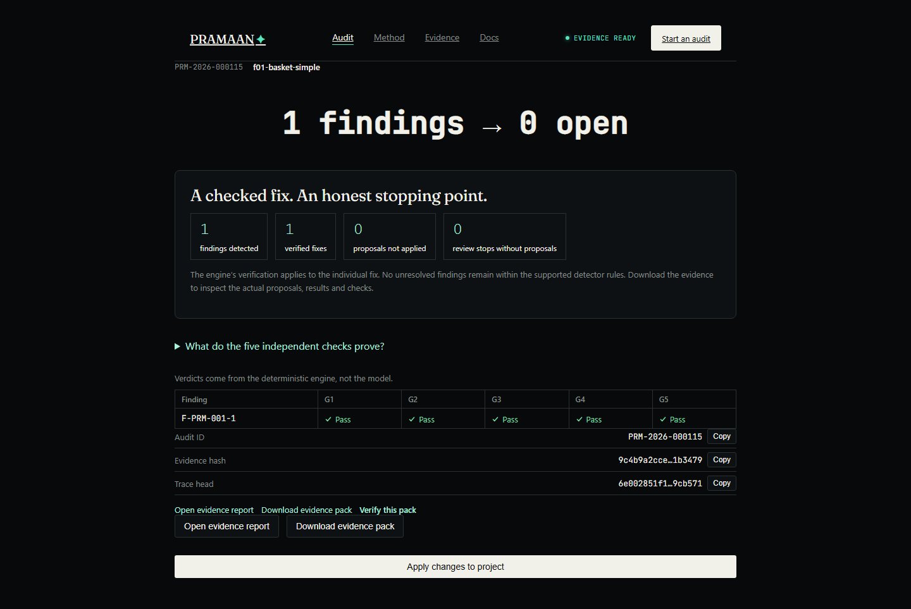

<div align="center">

# PRAMAAN

**Find deceptive UI patterns. Fix them. Prove it.**

A deceptive-interface remediation and evidence engine for React/TypeScript
frontends — scan → agent-proposed fix → deterministic re-verification →
tamper-evident evidence pack.

`Node ≥20` · `TypeScript` · `React` · `Fastify` · Bharat Agentic 2026

</div>

---

## Submission

| | |
|---|---|
| **Project name** | PRAMAAN |
| **Team** | DrCode — Mohammed Afnan, Shivam Kumar |
| **Domain** | Developer & AI |
| **GitHub repository** | [github.com/tchxm/Pramaan](https://github.com/tchxm/Pramaan) |
| **Problem statement** | See [Why](#why) below |
| **Solution overview** | See [What it detects](#what-it-detects) and [The pipeline](#the-pipeline) |
| **Agent workflow / architecture** | See [Architecture](#architecture) |
| **Technology stack** | See [Technology stack](#technology-stack) |
| **Working demo** | In progress — will be added to this repository |
| **2-minute demo video** | [Finished local MP4](deliverables/PRAMAAN_DrCode_2min_demo.mp4); upload URL pending |
| **5-slide pitch deck** | [View pitch deck (PDF)](deliverables/PRAMAAN_5_Slide_Pitch_Deck.pdf) |

## Why

Dark patterns — pre-ticked checkboxes, fake countdown timers, a "reject" button
styled to disappear, a fee that shows up only at the last step — are easy to
ship and hard to self-audit, because the people shipping them aren't looking
for them. PRAMAAN is that audit: it finds the pattern in source code, lets an
LLM agent propose a concrete fix, and — critically — never lets the LLM mark
its own homework. A separate deterministic engine re-runs the same checks plus
a real browser pass before anything is called `VERIFIED`. The output is a
hash-chained evidence pack, not a vibe.

> Pramaan identifies technical patterns associated with deceptive interfaces,
> maps them to relevant regulatory guidance, and produces evidence supporting
> a self-audit. It does not provide legal certification.

## What it detects

Five pattern families. Four are fully deterministic — no LLM anywhere in the
detection path.

| Pattern | Family | Example |
|---|---|---|
| Basket sneaking | deterministic | an item added to cart without explicit user action |
| False urgency | deterministic | a countdown timer with no real deadline behind it |
| Interface interference | deterministic | a "reject all" control styled to be harder to see/click than "accept" |
| Drip pricing | deterministic | a mandatory fee disclosed only at the last checkout step |
| Confirm-shaming | semantic candidate | guilt-tripping opt-out copy — always routed to human review, never auto-verdicted |

Every finding carries structured evidence (source location, DOM/CSS capture,
computed styles) and a mapped reference to relevant Indian regulatory guidance
(CCPA guidelines, Consumer Protection Act provisions) — paraphrased, never
asserting legal certification.

## The pipeline

```
scan ──▶ investigate ──▶ patch ──▶ verify (G1–G5) ──▶ evidence
 │            │              │            │               │
 engine      agent        isolated     engine +        hash-chained,
 finds      proposes a     workspace    real browser    tamper-evident
 candidates  strategy      copy only    re-check        pack
```

1. **Scan** — the deterministic engine finds candidate violations in source.
2. **Investigate** — a tool-calling LLM agent, bounded by a tool-call and
   token budget, inspects the finding and picks a remediation strategy from a
   fixed, whitelisted set. It cannot invent new patch operations.
3. **Patch** — applied to an isolated copy of the workspace. The original is
   never touched until a fix verifies.
4. **Verify (G1–G5)** — the same deterministic detectors re-run, plus a real
   headless-browser runtime check, confirming the violation is actually gone
   and nothing else broke.
5. **Evidence** — a SHA-256 hash-chained evidence pack is written. `/verify`
   (web) or `pramaan verify` (CLI) catches any after-the-fact edit to it.

**The deterministic engine decides every verdict — never the LLM.** The agent
proposes; `detector.verify` disposes. If the agent can't produce a passing
fix, or no LLM is configured, PRAMAAN says so honestly (`Agent unavailable`)
instead of fabricating a result. Deterministic detection still runs either
way.

## Architecture

```text
┌──────────────────────────────────────────────────────────────────────┐
│ PRESENTATION   packages/web (React)      packages/cli (Node)          │
├──────────────────────────────────────────────────────────────────────┤
│ SERVICE        packages/server (Fastify: REST + Server-Sent Events)   │
├──────────────────────────────────────────────────────────────────────┤
│ AGENT          packages/agent  (LLM client, tool registry, loop,      │
│                                 budget, trace, approval handshake)    │
├──────────────────────────────────────────────────────────────────────┤
│ ENGINE (truth) packages/core                                          │
│   parser · style/cascade · detectors · price-flow · regulation        │
│   patch planner + policy · verify gates · runtime probes · evidence   │
└──────────────────────────────────────────────────────────────────────┘
```

Dependency direction is strictly downward — `core` never imports `agent`.

The LLM layer supports multiple providers with automatic fallback
(Anthropic → Gemini → Groq → OpenRouter → Cloudflare Workers AI, configurable
via `PRAMAAN_LLM_PROVIDERS`) so a live demo isn't hostage to one provider's
rate limit.

## Technology stack

| Layer | Stack |
|---|---|
| Language | TypeScript (strict, ESM) across the whole monorepo |
| Engine (`core`) | Babel parser/traverse/generator (AST analysis), PostCSS + postcss-selector-parser (cascade analysis), Playwright (runtime/browser verification), Zod (schema validation), `diff` (patch generation) |
| Agent (`agent`) | Anthropic SDK + a shared OpenAI-compatible adapter fanning out to Gemini, Groq, OpenRouter, and Cloudflare Workers AI, with automatic sticky fallback |
| Service (`server`) | Fastify, REST + Server-Sent Events for live trace streaming |
| Web (`web`) | React, React Router, Zustand, Three.js (hero scene) |
| CLI (`cli`) | Node, built on the same `core`/`agent` packages as the server |
| Tooling | npm workspaces, Vitest (unit/integration), Playwright Test (e2e) |

## Quickstart

```bash
npm install
npm run build
npx playwright install chromium   # needed for runtime verification (G4)

# scan a fixture without an LLM — deterministic detection only
npm run pramaan -- scan ./fixtures/f06-mitti-mart

# full audit with a live LLM agent (needs at least one provider key — see .env.example)
npm run pramaan -- audit ./fixtures/f06-mitti-mart

# start the server + web app for the interactive demo
npm run demo
```

## Testing

```bash
npm test          # unit + integration (vitest)
npm run e2e        # Playwright end-to-end suite against a real server + browser
npm run typecheck
```

`fixtures/` doubles as the test corpus — including `f07-prompt-injection` and
`f08-cheat-attempts`, which exist specifically to confirm the agent can't be
talked into fabricating a verdict or stepping outside its whitelisted tools.

## Project layout

```
packages/
  core/     the engine — parser, detectors, patch planner/policy, verify gates, evidence
  agent/    LLM client, tool registry, bounded agent loop, trace, approval handshake
  server/   Fastify REST + SSE API
  web/      React workspace UI
  cli/      pramaan scan / audit / inspect / verify / apply
fixtures/   sample projects used as both demo material and the test corpus
docs/       SPEC.md — the authoritative behavioral specification
```

## Environment variables

Copy `.env.example` to `.env` at the repo root. See `docs/SPEC.md` §6.1 for
the full list (`LLM_API_KEY`/`ANTHROPIC_API_KEY`, `GEMINI_API_KEY`,
`GROQ_API_KEY`, `OPENROUTER_API_KEY`, `CLOUDFLARE_*`, `PRAMAAN_LLM_PROVIDERS`,
`PRAMAAN_RUNTIME`, `PORT`, etc.). `.env` is gitignored and never committed.

## Known limits

- The evidence hash is unsigned: it detects edits, it does not prove
  authorship.
- Detectors cover five specified pattern families only; absence of a finding
  is not a claim that a project has no dark patterns.
- Static analysis has documented blind spots (runtime-only style mutation,
  CSS-in-JS, Tailwind utility classes, `@media`/`@supports` contents); the
  runtime gate (G4) is the backstop, not a replacement, for what static
  analysis cannot see.
- PRAMAAN does not provide legal certification. See the disclaimer above.

## Judge walkthrough and observed evidence

Start with **Watch the demo** on the landing page. The saved checkout example
explains the shopper problem, the actual source edit and the real engine
results. Its guided four-finding run is explicitly labelled **Scripted
decisions · actual engine execution**: one verified fix, one proposal-only
stop and two review-only stops. See [the walkthrough](docs/DEMO_WALKTHROUGH.md).

The 1 October 2026 audit also observed a separate real Groq tool-calling run:
one finding became zero unresolved, all five verification gates passed, and
the pack hash plus matching trace chain/head verified. The full four-finding
live run remains unreliable under provider quotas. See the
[submission audit](docs/SUBMISSION_AUDIT.md) for results, fixes and limits, and
the [two-minute film plan](docs/demo-video/VIDEO_PLAN.md) with
[recording copy](docs/demo-video/VOICEOVER.md). The [finished two-minute MP4](deliverables/PRAMAAN_DrCode_2min_demo.mp4) is ready locally. Video upload and the public demo destination are still pending.



The engine edits an isolated workspace. API/CLI writeback refuses incomplete
audits or applied patches whose findings have not verified. Evidence hashes
detect edits; they are unsigned. Upload the matching `trace.jsonl` alongside
the pack to check chain integrity and its committed head, rather than only
the pack hash. Local filesystem audit APIs require additional isolation and
access control before public multi-tenant hosting.

## Source of truth

`docs/SPEC.md` is the authoritative behavioral specification for this build.
Where any other document disagrees with it on product behavior, the spec
wins.
